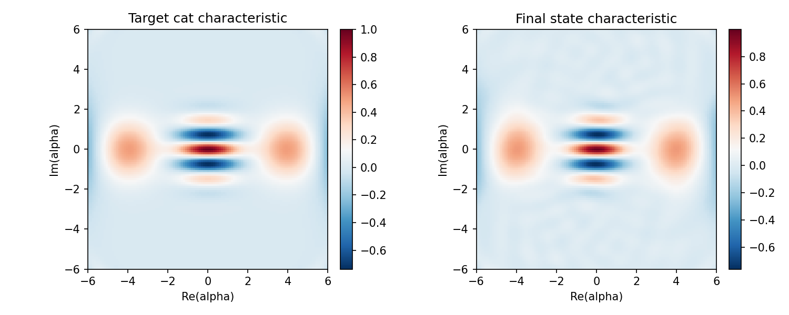
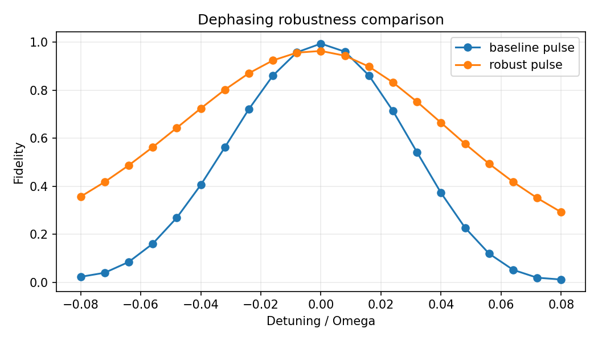
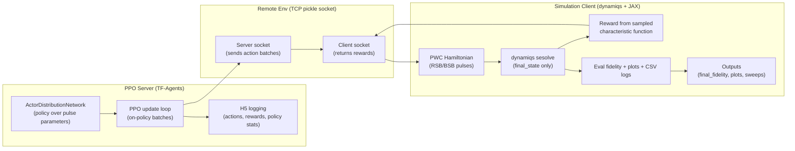
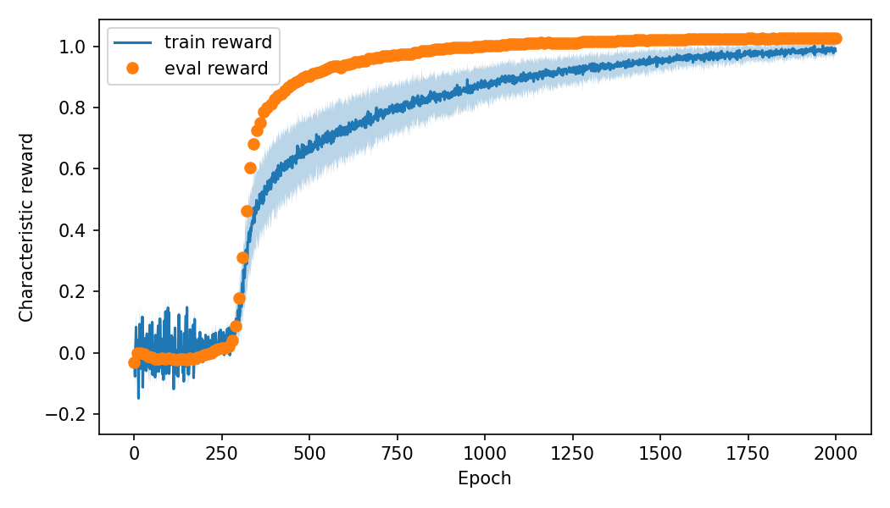
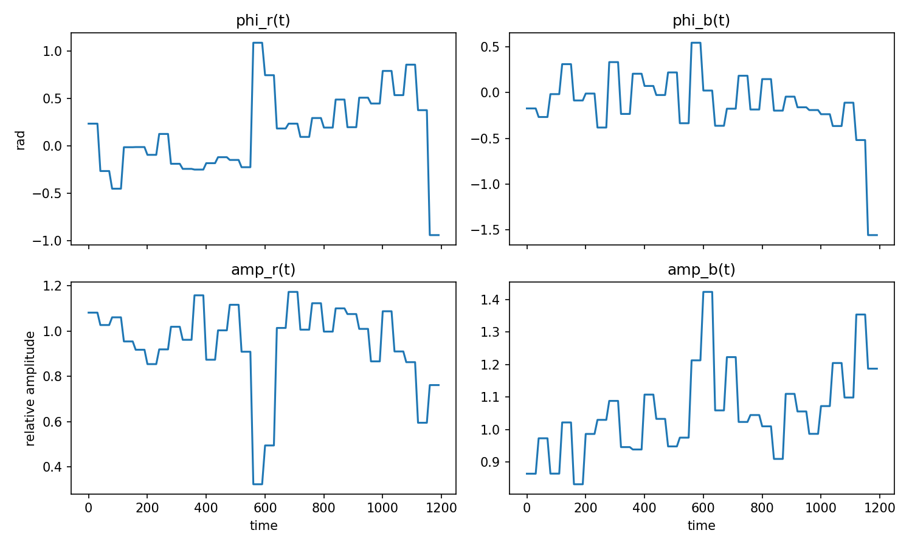
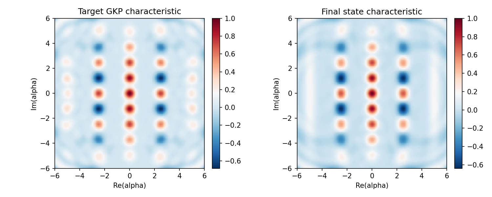

# Trapped-Ion RL Control (PPO + dynamiqs)

**Model‑free, measurement‑style RL for bosonic state preparation**

- Repo: `trapped-ion-rl-control-4`
- Pipelines: Cat / GKP / Binomial (+ dephasing‑robust)
- Date: 2026‑02‑23



<!-- speaker notes -->
Open with a concrete result image from the repo to anchor the story.

---

# What is actually in the repo (real artifacts)

**Committed outputs (not placeholders):**
- Final fidelities: cat 0.995170, GKP 0.987612, binomial 0.970885
- Robust metrics: `final_robust_score.txt` (binomial)
- Robust sweeps: `dephasing_compare.csv/png`, `dephasing_sweep_robust.csv/png`
- Training/eval plots: `training_curve.png`, `eval_fidelity_curve.png`
- Sampling GIFs: `characteristic_points_evolution.gif`

**Where to find them:**
- `examples/trapped_ion_cat/outputs/`
- `examples/trapped_ion_gkp/outputs/`
- `examples/trapped_ion_binomial/outputs/`



<!-- speaker notes -->
Everything shown later is tied to files actually committed in the repo.

---

# Physics setup (control task)

**System:** internal qubit + motional bosonic mode

**Controls:** piecewise‑constant red/blue sideband pulses
- Parameters per segment: `phi_r`, `phi_b`, `amp_r`, `amp_b`
- Duration: `N_STEPS` total steps, `N_SEGMENTS` segments (`SEG_LEN = N_STEPS / N_SEGMENTS`)

**Goal:** prepare cat / GKP / binomial target states

**Constraint:** reward must be experimentally motivated (measurement‑style)


<!-- speaker notes -->
We optimize pulse schedules; the reward comes from phase‑space measurements, not full fidelity.

---

# Action parameterization (what PPO learns)

**Action vector per episode (default):**
- `phi_r` (phase RSB), `phi_b` (phase BSB)
- `amp_r`, `amp_b` (amplitudes; optional to learn)

**Default scales (cat/binomial training servers):**
- Phase scale: `pi`
- Amp scale: `1.0` (cat/binomial), `0.35` for GKP

**Residual learning:** start from scripted pulses and learn residuals

**Key files:**
- `examples/trapped_ion_cat/trapped_ion_cat_training_server.py`
- `examples/trapped_ion_binomial/trapped_ion_binomial_training_server.py`
- `examples/trapped_ion_gkp/trapped_ion_gkp_training_server.py`

<!-- speaker notes -->
The actor outputs segment‑level deltas (residuals) with scaling.

---

# PPO hyperparameters (default settings)

**Cat / Binomial (default):**
- `NUM_EPOCHS=300` (cat/binomial)
- `TRAIN_BATCH_SIZE=160`
- `EVAL_INTERVAL=20`, `EVAL_BATCH_SIZE=5`
- `PPO_LR=1e-4`, `PPO_ENTROPY_REG=5e-3`
- `PPO_INIT_STD=0.3`, `PPO_NUM_POLICY_UPDATES=20`

**GKP (default):**
- `NUM_EPOCHS=2000`
- `PPO_LR=3e-4`, `PPO_ENTROPY_REG=2e-4`
- `PPO_INIT_STD=0.12`, `PPO_NUM_POLICY_UPDATES=10`

**Key files:**
- `examples/trapped_ion_*/*_training_server.py`

<!-- speaker notes -->
PPO settings differ for GKP due to longer training and more delicate targets.

---

# Server–client architecture (TCP remote reward)



**Key files:**
- `quantum_control_rl_server/remote_env_tools.py`
- `quantum_control_rl_server/tf_env.py`

<!-- speaker notes -->
Server and client can run in separate Python envs (TF vs JAX).

---

# Simulation engine & throughput

**dynamiqs + JAX**
- Piecewise‑constant Hamiltonians
- `dq.sesolve(..., save_states=False)` (final state only)

**Why:** avoids storing full trajectories → faster PPO epochs

**Key files:**
- `examples/trapped_ion_cat/trapped_ion_cat_sim_function.py`
- `examples/trapped_ion_gkp/trapped_ion_gkp_sim_function.py`
- `examples/trapped_ion_binomial/trapped_ion_binomial_sim_function.py`

<!-- speaker notes -->
Speed is critical because PPO needs many evaluations; we only need the final state.

---

# Characteristic‑function reward (formula)

**Characteristic samples:** alpha_k in phase space

**Measured values:**
```
chi_meas(alpha_k) = <D(alpha_k)>
```

**Normalized overlap reward (default):**
```
overlap = mean( chi_meas * conj(chi_target) / p(alpha) )
normalizer = mean( |chi_target|^2 / p(alpha) )
reward = overlap.real / normalizer
```

**Other objectives:**
```
NMSE:   1 - mean(|chi_meas-chi_target|^2 / p) / mean(|chi_target|^2 / p)
NMSEexp: exp(- mean(|chi_meas-chi_target|^2 / p) / mean(|chi_target|^2 / p))
|overlap|: |overlap| / normalizer
```

**Key files:**
- `examples/trapped_ion_cat/trapped_ion_cat_sim_function.py`
- `examples/trapped_ion_binomial/trapped_ion_binomial_sim_function.py`

<!-- speaker notes -->
The reward uses importance correction with p(alpha)=q(alpha).

---

# Wigner/parity fallback (optional)

If `reward_mode != characteristic`:
- Measure parity at displaced point
- Convert to Wigner sample

**Formula in code (sketch):**
```
W(alpha) = (2/pi) * parity
reward = mean(W_target * W_meas) / mean(W_target^2)
```

**Key file:**
- `examples/trapped_ion_cat/trapped_ion_cat_sim_function.py`

<!-- speaker notes -->
This is a fallback; default training uses characteristic reward.

---

# Sampling distribution & importance weights

**Sampling stages:**
- Stage 1: top‑k points (highest |chi_target|)
- Stage 2/3: radial‑stratified sampling

**Why:** reduce variance while covering large |alpha|

**Important detail:** use *actual* sampling distribution q(alpha)
```
q(alpha) computed from stratified sampling quotas
sample_weights = q(alpha)
```

**Figure:**
- `examples/trapped_ion_cat/outputs/characteristic_points_evolution.gif`

<!-- speaker notes -->
Using q(alpha) avoids reward bias; this is a core stability fix.

---

# Cat target definition

**Cat state in code:**
```
|psi_cat> ∝ |alpha> + exp(i*phi) | -alpha >
```
Default: even cat (phi=0)

**Defaults (cat client):**
- `N_BOSON=30`
- `ALPHA_CAT=2.0`
- `N_STEPS=120`, `N_SEGMENTS=60`, `T_STEP=10.0`

**Key file:**
- `examples/trapped_ion_cat/trapped_ion_cat_client.py`

<!-- speaker notes -->
Cat is a coherent superposition; truncation must be high enough for alpha.

---

# Cat results (training curves)

**Final fidelity:** 0.995170

**Artifacts:**
- `outputs/final_fidelity.txt`
- `outputs/training_curve.png`
- `outputs/eval_fidelity_curve.png`



<!-- speaker notes -->
Shows steady PPO improvement + refinement stage.

---

# Cat results (pulse structure)

**Pulse sequences:** `phi_r`, `phi_b`, `amp_r`, `amp_b`



**Key file:**
- `examples/trapped_ion_cat/plot_trapped_ion_cat_pulses.py`

<!-- speaker notes -->
Pulse plots validate that the policy discovers non‑trivial schedules.

---

# GKP target definition (finite‑energy)

**Approximate GKP basis state:**
```
|mu> ~ sum_k exp[-(kappa^2/2) q_k^2] D(q_k/sqrt(2)) S(r) |0>
q_k = (2k + mu) sqrt(pi)
```
Defaults: `r = -log(delta)`, `kappa = delta`

**Defaults (GKP client):**
- `N_BOSON=40`
- `GKP_DELTA=0.301`
- `GKP_LATTICE_TRUNC=4`
- `N_STEPS=120`, `N_SEGMENTS=60`

**Key file:**
- `examples/trapped_ion_gkp/trapped_ion_gkp_sim_function.py`

<!-- speaker notes -->
Finite‑energy GKP target aligns with paper‑style parametrization.

---

# GKP sampling details (lattice mix)

**Lattice‑mix sampling:**
- Mix reciprocal‑lattice anchor points into sampled set
- Params: `GKP_LATTICE_MIX`, `GKP_LATTICE_TOPK_BOOST`, `GKP_LATTICE_ORDER`

**Why:** stabilize training around GKP lattice structure

**Artifacts:**
- `examples/trapped_ion_gkp/outputs/characteristic_points_evolution.gif`

<!-- speaker notes -->
GKP is sensitive to sampling; lattice mix is critical for stability.

---

# GKP results

**Final fidelity:** 0.987612

**Artifacts:**
- `outputs/final_fidelity.txt`
- `outputs/char_target_vs_final.png`
- `outputs/training_curve.png`



<!-- speaker notes -->
GKP plateaus near 0.9876; more tuning likely needed for >0.99.

---

# Binomial target definition

**Default binomial code (PRX‑style):**
```
|d3_z> = (sqrt(3)|3> + |9>) / 2
```
Other options: `s1_plus`, `s2_plus` via `BINOMIAL_CODE`

**Defaults (binomial client):**
- `N_BOSON=30`
- `BINOMIAL_CODE=d3_z`
- `N_STEPS=120`, `N_SEGMENTS=60`, `T_STEP=1e-5`, `OMEGA_RABI_HZ=2000`

**Key file:**
- `examples/trapped_ion_binomial/trapped_ion_binomial_sim_function.py`

<!-- speaker notes -->
Binomial targets require truncation checks (tail mass diagnostics).

---

# Binomial nominal results

**Final fidelity:** 0.970885

**Artifacts:**
- `outputs/char_target_vs_final.png`
- `outputs/training_curve.png`
- `outputs/eval_fidelity_curve.png`


<!-- speaker notes -->
Nominal binomial baseline before robustness adjustments.

---

# Final refinement (all pipelines)

**Process:**
1. Collect top‑eval candidates
2. Multi‑round Gaussian perturbations
3. Keep best by fidelity/robust score
4. Optional full‑step refinement

**Key parameters (common):**
- `FINAL_REFINE_SAMPLES=512`
- `FINAL_REFINE_ROUNDS=8`
- `FINAL_REFINE_DECAY=0.6`
- `FINAL_REFINE_TOPK=24`

**Key files:**
- `examples/trapped_ion_cat/trapped_ion_cat_client.py`
- `examples/trapped_ion_binomial/trapped_ion_binomial_client.py`

<!-- speaker notes -->
Refinement is essential to push final fidelities above raw PPO results.

---

# Quasi‑static dephasing model (robust training)

**Hamiltonian:**
```
H = H_rsb/bsb + delta * n_hat
```

**Noise:**
```
delta ~ Uniform[-0.05*Omega, +0.05*Omega]
```

**Sampling:**
- `DEPHASE_NOISE_SAMPLES_TRAIN=6`
- `DEPHASE_NOISE_SAMPLES_EVAL=12`
- `DEPHASE_NOISE_SAMPLES_REFINE=16`
- `DEPHASE_INCLUDE_NOMINAL=1`

<!-- speaker notes -->
Quasi‑static = fixed detuning per trajectory.

---

# Robust objective (exact formula)

**Define:**
- `F_nom = fidelity(delta=0)`
- `F_rob = mean fidelity over noisy samples`
- `R_rob = mean reward over noisy samples`

**Penalty:**
```
penalty = ROBUST_FLOOR_PENALTY * max(0, ROBUST_NOMINAL_FID_FLOOR - F_nom)
```

**Training objective:**
```
R_train = R_rob - penalty
```

**Eval / selection score:**
```
score = F_rob - penalty
```

**Key file:**
- `examples/trapped_ion_binomial/trapped_ion_binomial_client.py` (_eval_robust_reward_and_fidelity_batch_full)

<!-- speaker notes -->
Robust score governs eval, refinement, and best‑pulse selection.

---

# Robust results (latest)

**Final robust metrics:**
- `score=0.820000`
- `f_nom=0.970885`
- `f_rob=0.834114`
- `penalty=0.014115`

**Artifact:**
- `examples/trapped_ion_binomial/outputs/final_robust_score.txt`


<!-- speaker notes -->
Robust pulses trade nominal fidelity for stability across detuning.

---

# Robust vs baseline sweep (evidence)

From `dephasing_compare.csv`:
- At delta=0: robust 0.9709 vs baseline 0.9947
- Mean over sweep: robust 0.6995 vs baseline 0.4270
- Min over sweep: robust 0.2942 vs baseline 0.0119


<!-- speaker notes -->
This is the core robustness validation.

---

# Penalty sweep (trade‑off curve)

**Sweep:** `ROBUST_FLOOR_PENALTY` in {0, 0.5, 1, 2, 4}

**Completed:** p=0 / 0.5 / 1

**Pending:** p=2 / 4 (PBS hold due to SU limit)

**Artifacts:**
- `examples/trapped_ion_binomial/penalty_sweep/penalty_sweep_20260221_161731/p_0/*`
- `examples/trapped_ion_binomial/penalty_sweep/penalty_sweep_20260221_161731/p_0p5/*`
- `examples/trapped_ion_binomial/penalty_sweep/penalty_sweep_20260221_161731/p_1/*`

<!-- speaker notes -->
Once complete, this yields a Pareto curve (robust vs nominal).

---

# Logs & diagnostics

**Server/client logs (examples):**
- `examples/trapped_ion_binomial/outputs/logs/*.log`
- `logs/qcrl_binomial_sweep_pbs.log`

**What to show:**
- Final refinement progress lines
- Robust score updates

**Example (from client log):**
```
Final robust metrics: score=0.820000 f_nom=0.970885 f_rob=0.834114 penalty=0.014115
```

<!-- speaker notes -->
Logs provide traceability for refinement stages and final metrics.

---

# Reproducibility (exact commands)

**Cat**
```bash
cd examples/trapped_ion_cat
bash run_with_logs.sh
```
Expect: `outputs/final_fidelity.txt`, plots in outputs

**GKP**
```bash
cd examples/trapped_ion_gkp
bash run_with_logs.sh
```
Expect: `outputs/final_fidelity.txt`, `eval_fidelity.csv`, GIF in outputs

**Binomial**
```bash
cd examples/trapped_ion_binomial
bash run_with_logs.sh
```
Expect: `outputs/final_fidelity.txt`, `eval_robust_metrics.csv`, sweep CSVs

<!-- speaker notes -->
All pipelines are reproducible via run_with_logs.sh.

---

# HPC / environment notes

- Server uses TF‑Agents; client uses dynamiqs+JAX
- Recommended: separate venvs (TF server, JAX client)
- GKP uses QCRL_HOST / QCRL_PORT; cat/binomial use HOST / PORT

**Docs:** `gadi/README_GADI.md`

<!-- speaker notes -->
Most practical issues are dependency conflicts or port mismatches.

---

# Known pain points & risk areas

- **GKP plateau** near 0.9876 (reward–fidelity alignment and truncation may matter)
- **Robust trade‑off**: nominal fidelity drops as robustness increases
- **Compute cost**: robust sampling multiplies evaluations

<!-- speaker notes -->
These guide where to spend next optimization effort.

---

# Next steps

- Finish penalty sweep p=2/4 once SU quota is available
- Move to **stochastic dephasing** (segment‑wise random detuning)
- Continue GKP plateau investigation (sampling + truncation tuning)

<!-- speaker notes -->
Stochastic dephasing likely needs a short design discussion before implementation.
